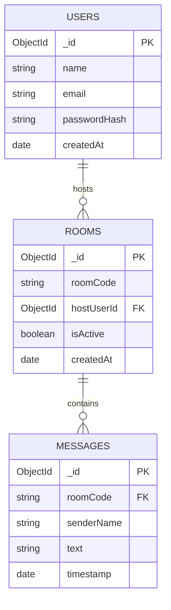

# Database schema — ConnectSphere

Notes:
- `roomCode` should be short, unique, and URL-safe (e.g. nanoid, 8 chars) — this is what goes in the shareable link.
- `MESSAGES.roomCode` is denormalized (not an ObjectId ref) so chat history survives even if a room is deleted.
- Guests (non-logged-in joiners) are never written to `USERS` — they only exist as Socket.IO connection state (`socketId`, `displayName`), not persisted.
